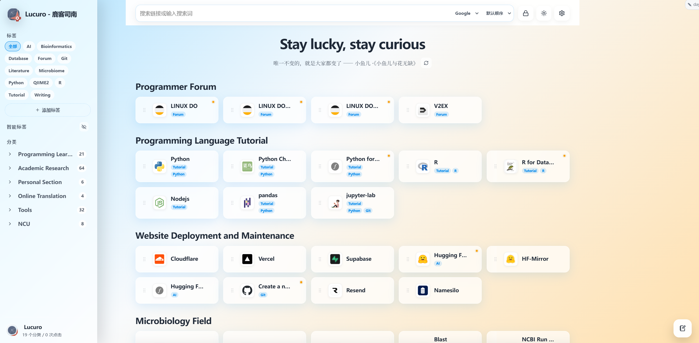
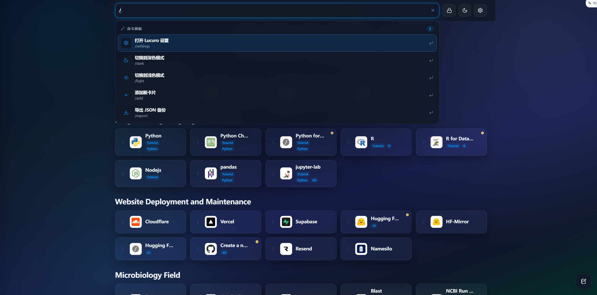
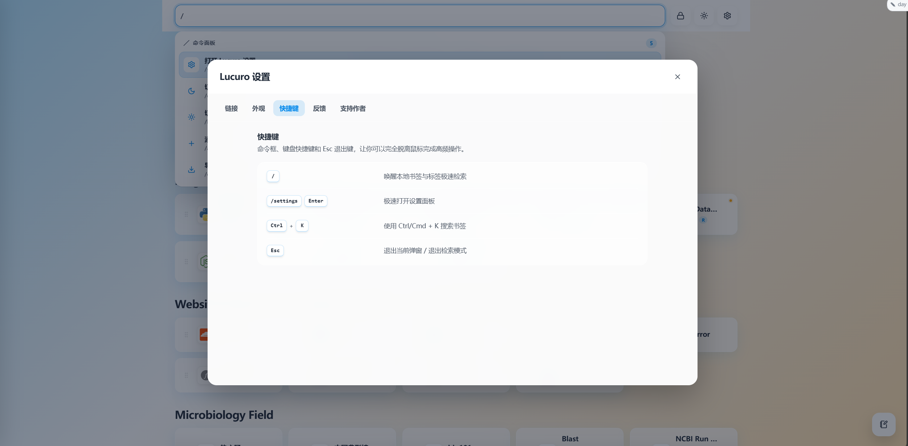

# Lucuro - 鹿客司南

**Lucuro - 鹿客司南** 的私有源码仓库，一个基于 Vue 3、Vite、Manifest V3 与 webextension-polyfill 的轻量本地优先浏览器新标签页扩展。

<a id="readme-top"></a>

语言：**简体中文** | [English](./README.md) | [Issues](https://github.com/Helloxiaolaodi/Lucuro/issues)

## 截图

<p align="center">
  
  &nbsp;
  
</p>

<p align="center">
  
</p>

## 快速开始

```bash
npm install
npm run dev
npm run build
```

生产构建输出到 `dist/`，每次构建后由 `rollup-plugin-visualizer` 生成 `stats.html`。

商店上传包生成在 `D:\YL2026\Vue\Release\`，包括 `lucuro-chrome-v0.2.0.zip`、`lucuro-edge-v0.2.0.zip`、`lucuro-firefox-v0.2.0.zip` 与 `lucuro-source-v0.2.0.zip`。

## 本地安装与调试

如果你希望通过源码在本地运行或测试 **Lucuro**，可以按照以下对应浏览器的步骤进行安装。

### 谷歌浏览器 (Chrome)

1. 打开 Chrome 浏览器，在地址栏输入并回车：`chrome://extensions/`
2. 点击页面右上角，开启 **「开发者模式 (Developer mode)」**。
3. 点击左上角的 **「加载已解压的扩展程序 (Load unpacked)」**。
4. 在弹出的文件选择窗口中，选中本项目编译生成的 **`dist/`** 文件夹。
5. 打开一个新的标签页，即可成功加载并体验 **Lucuro**。

### 微软浏览器 (Edge)

1. 打开 Edge 浏览器，在地址栏输入并回车：`edge://extensions/`
2. 观察左侧边栏底部，开启 **「开发人员模式 (Developer mode)」** 开关。
3. 点击顶部的 **「加载解压缩的扩展 (Load unpacked)」**。
4. 在弹出的文件选择窗口中，选中本项目编译生成的 **`dist/`** 文件夹。
5. 打开一个新的标签页，即可成功加载并体验 **Lucuro**。

### 火狐浏览器 (Firefox)

1. 打开 Firefox 浏览器，在地址栏输入并回车：`about:debugging#/runtime/this-firefox`
2. 点击页面右上角的 **「临时加载附加组件... (Load Temporary Add-on...)」** 按钮。
3. 在弹出的文件选择窗口中，进入 `dist/` 文件夹并选中 **`manifest.json`** 文件（或该目录下的任意文件）。
4. 打开一个新的标签页，即可成功加载并体验 **Lucuro**。

## 功能

- 新标签页工作台：树状侧边栏分类、搜索、拖拽卡片、自定义一言、今日手记 Markdown 工具栏、撤销/清空与自动隐藏侧边栏
- 工具栏弹窗：切换新标签页启动方式，可选 Lucuro 主页或浏览器默认主页；浏览器默认主页通过 `tabs.create({})` 打开浏览器原生新标签页
- 通过内置 `bookmarks` 权限自动导入浏览器原生书签树
- 数据来源互斥切换：浏览器书签或用户上传的本地 JSON 文件
- 背景图片支持模糊、选区裁剪与可调节遮罩层，默认头像使用 Lucuro 标识
- 使用 `chrome.storage.sync` 原生同步并保留本地回退
- 海外赞助使用 Ko-fi，国内赞助使用微信收款码
- 本地优先，无需账号，无遥测，无外部同步服务

## Additional community link:

- [LINUX DO](https://linux.do/) - A next-generation Linux community

## License

This project is licensed under the [MIT License](LICENSE).

[Back to top](#readme-top)